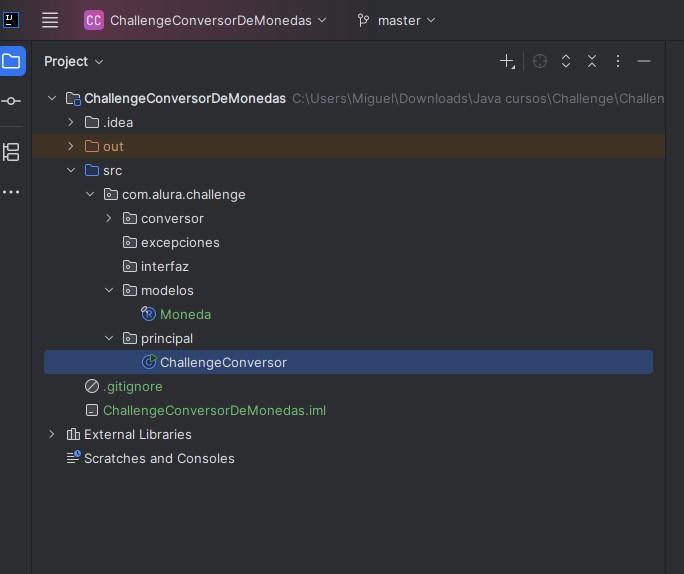
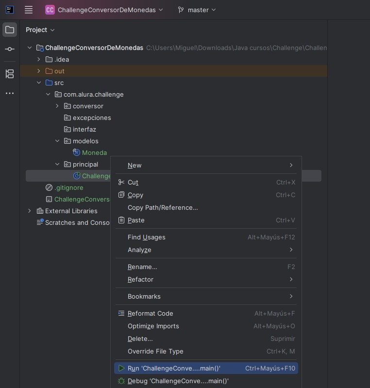
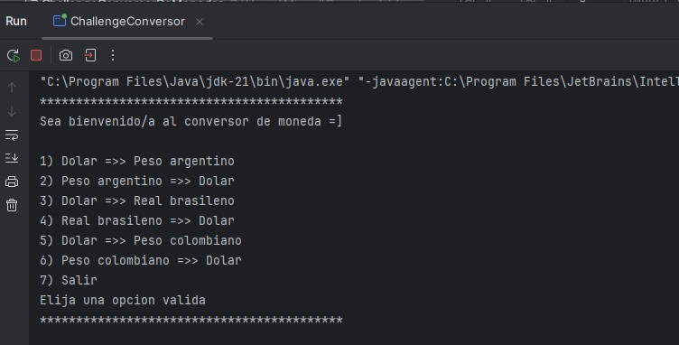
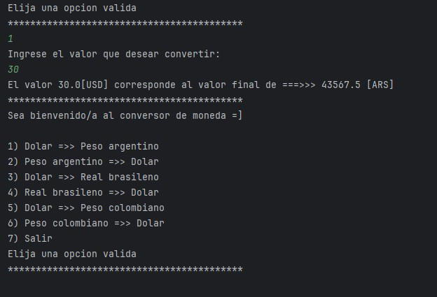
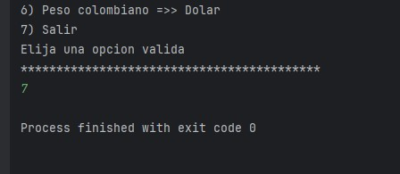
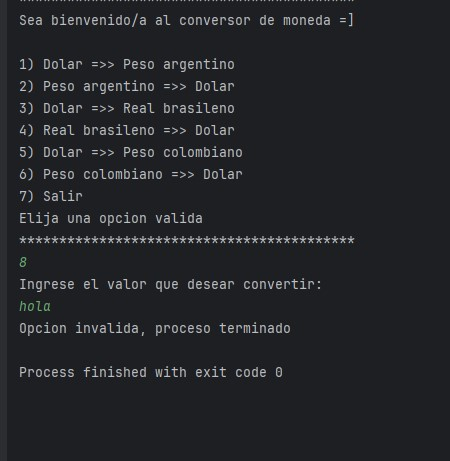
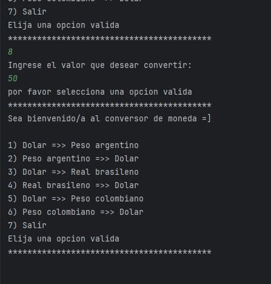

# Challenge conversor de moneda

Este challenge es en general una herramienta donde se pueden hacer los cambios de 6 tipos de moneda. Se puede abrir el proyecto desde el link brindado a continuación, luego se repasaran varios puntos aclarando varias funcionalidades o información que crea necesaria para que se pueda usar sin problemas.
https://github.com/MiguelSanchezG/ChallengeConversorDeMonedas


## Tabla de contenido

- [Instalación](#instalación)
- [Uso](#uso)

## Instalación
1. Para este caso no es realmente necesaria una instalacion, se puede simplemente copiar el repositorio en la carpeta de tu preferencia:
   ```bash
   git clone https://github.com/MiguelSanchezG/ChallengeConversorDeMonedas.git
2. puede verificar los archivos y el código abriendo el proyecto con IntelliJ o el IDE de tu preferencia.

## Uso

1. Ya con la el proyecto abierto, seleccionamos solo es buscar en las carpetas del proyecto, la clase de la carpeta principal 



2. luego a la clase le damos click derecho y saldra el siguiente menu y seleccionaremos la opcion Run



3. entonces, desde la IDE el programa mostrara las opciones que tiene a seleccionar



4. y al seleccionar una de las opciones simplemente debemos darle el valor que deseamos convertir, dándonos la respuesta acorde




5. también si no damos un valor no acorde, el programa se puede cerrar, esto para controlar que no haya algún error.




